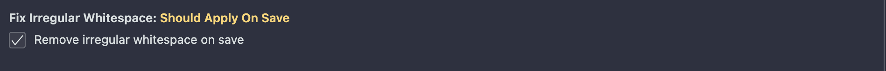

# Fix Irregular Whitespace

Cleans up your code by replacing all unusual whitespace characters with regular spaces

## Features

- Automatically replaces irregular space characters when saving a file
- Adds a "Fix Irregular Whitespace in Current File" command to manually clean up irregular whitespace in the active file
- Adds a "Fix Irregular Whitespace in Workspace" command to clean up all files in the workspace:
  - Files not open in vscode will be rewritten and saved
  - Others will be updated in the editor without being saved

## Settings

### Enable or disable automatic irregular whitespace cleanup on save

By default, this extension automatically removes all irregular whitespace from your active file when you save. You can disable this behavior in your user settings by unchecking the following option:

```
Fix Irregular Whitespace: Should Apply On Save
```



Alternatively, you can disable it directly in your `vscode settings.json by adding the following line:

``` json
"fixIrregularWhitespace.shouldApplyOnSave": false
```


## List of Irregular spaces

Handle all the irregular whitespaces from the **Eslint** `no-irregular-whitespace` rule.

https://eslint.org/docs/rules/no-irregular-whitespace

## Mention

For more details about the irregular whitespaces, and a visual usage of the extension! You can check the following article:

https://allalmohamedlamine.medium.com/fixing-and-removing-irregular-spaces-984389e17132

## Release Notes

### 0.2.0

- ✅ Add option to disable automatic cleanup on save 
- ✅ Provide feedback on how many characters were replaced (if any)

### 0.1.0

Add support to all irregular whitespaces listed in eslint no-irregular-whitespace rule, as per https://eslint.org/docs/rules/no-irregular-whitespace

### 0.0.1

Initial release

## Contributors

<a href="https://github.com/karlito40/fix-irregular-whitespace/graphs/contributors">
  
</a>


